# Smarthome-dashbutton

Here is something for the smart home lovers which want to control their whole lights, thermostats or any other smart devices from the sofa without the need of actuating the wall switch.

The goal of this project is to build an electronic device which occupies following aspects:
- one control button
- as small as possible
- as fast as possible
- portable (battery powered)
- wifi ability

Especially because the dashbutton should be as small as possible there are only the most necessary parts onto the PCB.

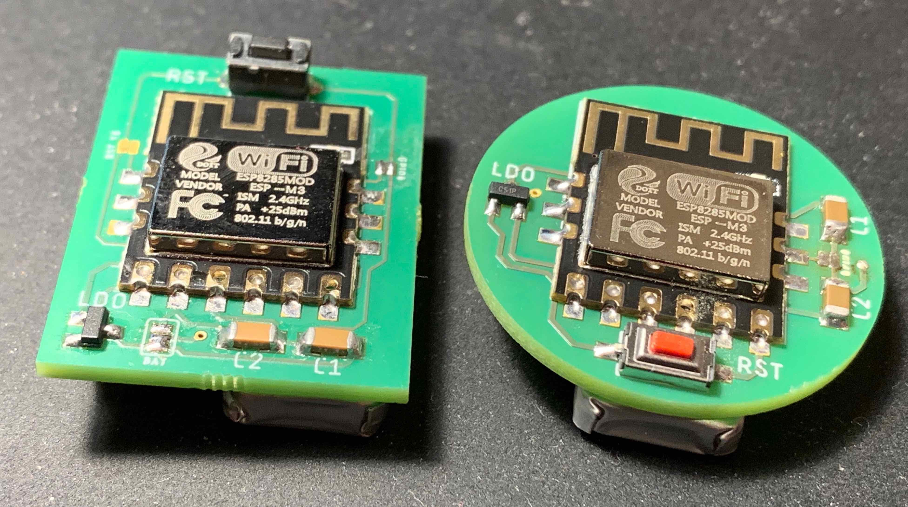
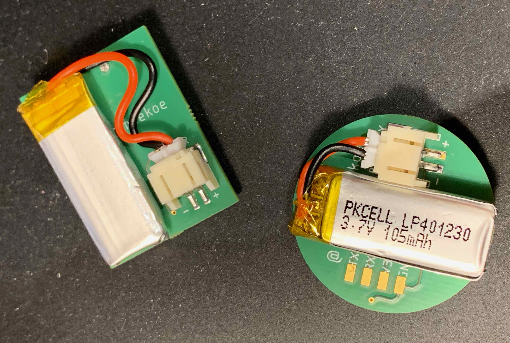

Here is a video to see the first version of the dashbutton in action. (Click on the image)

<a href="https://www.instagram.com/p/Bqrb7guHYCT/?utm_source=ig_web_button_share_sheet">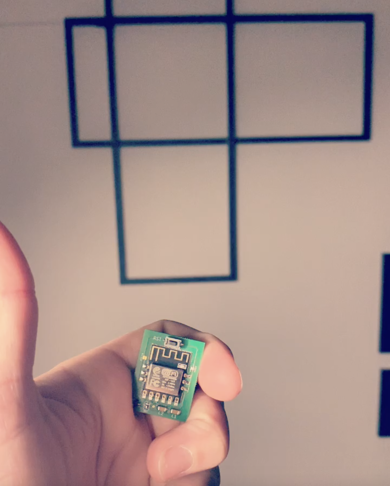</a>

## Requirements

In total the parts for each dashbutton amount to a considerable sum of just 5€. If you click on the component you will be forwarded to an example product on aliexpress.

- PCB (... following, but the eagle files are accessible in this GitHub repository)
- [ESP8285-M3](https://de.aliexpress.com/item/ESP8285-ESP-M3-Serial-Port-Transparent-Drahtlose-WiFi-Steuer-Modul-Kompatibel-mit-ESP8266/32906969552.html?spm=a2g0x.search0104.3.8.5dd24d46hq1LnX&ws_ab_test=searchweb0_0%2Csearchweb201602_5_10065_10068_319_317_10548_10696_453_10084_454_10083_10618_10307_10820_10821_538_10303_537_10302_536_10059_10884_10887_100031_10319_321_322_10103%2Csearchweb201603_51%2CppcSwitch_0&algo_pvid=9139143b-1052-497f-be3f-c89ec20699f7&algo_expid=9139143b-1052-497f-be3f-c89ec20699f7-1)
- Two SMD capacitors (1 microfarads with the dimensions of 1206)
- MCP1700 3.3V LDO
- 3x6mm SMD button
- JST-PH 2mm 90° SMD connector
- Lipo battery (with dimensions of 25x12mm)

## How the code works

It is up to you where you want to use the smart home dashbutton for. In my case it is integrated to Apples HomeKit, but it should be easy to shift it to another framework, because the current code is based on a separated bridge which communicates over the MQTT protocol.

After rebooting, the ESP8285 will connect to the specified wifi network as well as to the MQTT broker (which is in my case the bridge). When the connection could be established the dashbutton sends a single '0' to the MQTT broker before it will go back to deepsleep mode. When the connection couldn't be established within five seconds, it will fall back into deepsleep mode as well, but without publishing anything. This is just for the case if the network is unreachable and the dashbutton tries to connect until the battery is empty. The button itself does the magic by simply resetting the ESP8285.
The string which will be send by the dashbutton when the button is pressed depends on your used home automation service. In my case I am using the 'programmable switch event' service in HomeKit (HAP-NodeJS) which operates with three states (0, 1, 2). Depending on that state HomeKit is able to act differently. A 0 will be interpreted as a single button press, a 1 will be interpreted as a double button press and a 2 will be interpreted as a long button press. Of course, this functionality is not usable with this kind of dashbutton, because it actually can only detect a single button press (as a microcontroller reset). With version 4 I am trying to add a second button, but more on this later.

### Version 4
As I said, this version of my dashbutton consists of an extra button, which can be assigned to a different functionality in your application. In my case (HomeKit/HAP-NodeJS) I can assign this extra button for the stateless switch accessory in HAP-NodeJS to the function 'second press'. __BUT__ this button can not be used standalone. As you may read in the upper part, the dashbutton is in deepsleep mode for 99% of the time. To wake it up from there you __have to__ press the RESET button first. Afterwards - in a specific amount of time/till the ESP goes to deepsleep again - you can hit the second button, which just sends another MQTT message to the broker. When not pressing the second button in the specified time, the dashbutton sends the 'normal' MQTT message, which it sends for the older versions of my dashbuttons as well.

## Flashing the dashbutton

Flashing the microcontroller on the pcb may not the easiest part. But thererfore that the dashbutton should be as small as possible, there are also as less as possible components on it. To flash it, there are three important things which you should make use of.

- The GPIO0 (PROG for version three) wire pad jumper should be shortened to put the ESP in programming mode. For version 4 the wire pad is replaced by a small button. Have in mind, that the microcontroller won't start as usual with a shortened GPIO0/PROG wire pad.
- You have to connect the four wire pads (3,3v - gnd - rx - tx) to an external FTDI adapter. Doing so, you don't have to solder some wires to it. Because I have aligned the four wire pads in the 2,54 mm, grid you can take a 4-pin pinheader, connect it with jumper cables to the FTDI adapter and press it against the wire pads while uploading the sketch. And because a picture is worth than thousand words, I added one showing this process.
- Right after the uploading message inside the Arduino IDE appears, you have to press the reset button once (it is THE button - the only button on the dashbutton). After this the blue led on the ESP should flash a few times until it flashes constantly while the uploading bar inside the Arduino IDE fills up.

## Schematics and PCB

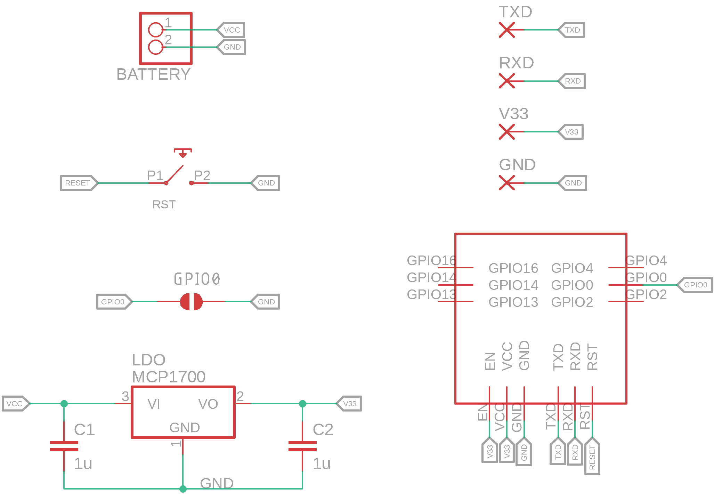

__Version 1__ was my first final draft which has some things to optimize. Maybe I will update it in the future but it is working already. The PCB has the outer dimensions of 24x32mm. It is powered by a small LiPo battery and has just a voltage regulating unit for powering the ESP8285-M3. The battery sticks with some doublesided tape on the bottom of the dashbutton.

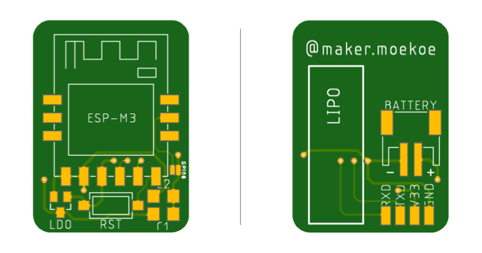

__Version 2__ consists of another outer shape of the PCB. It is round with a diameter of 30 mm and includes a ground plane over two-thirds of the area. The other third is the antenna of the microcontroller and shouldn't be overlapped with any of the traces or ground signals to reduce interferences. The schematic is the same as version one. And just as version one it is based on an ESP8285-M3.

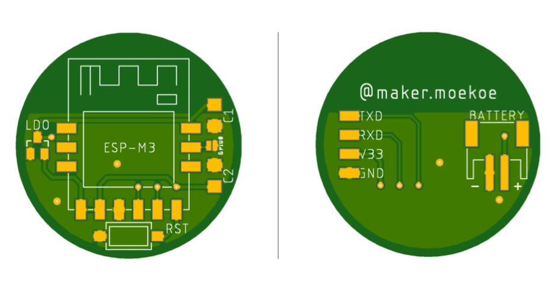

__Version 3__ has another outer shape as well. Main difference is that it is powered by a standard LIR2450 battery which can be replaced easily if it's getting empty and therefore the PCB has to be a little bit bigger than the other versions. Additionally, it consists of an WS2812b rgb(w) led to inform on different things. Furthermore and in contrast to the other two versions it is based on an ESP8266-07S.

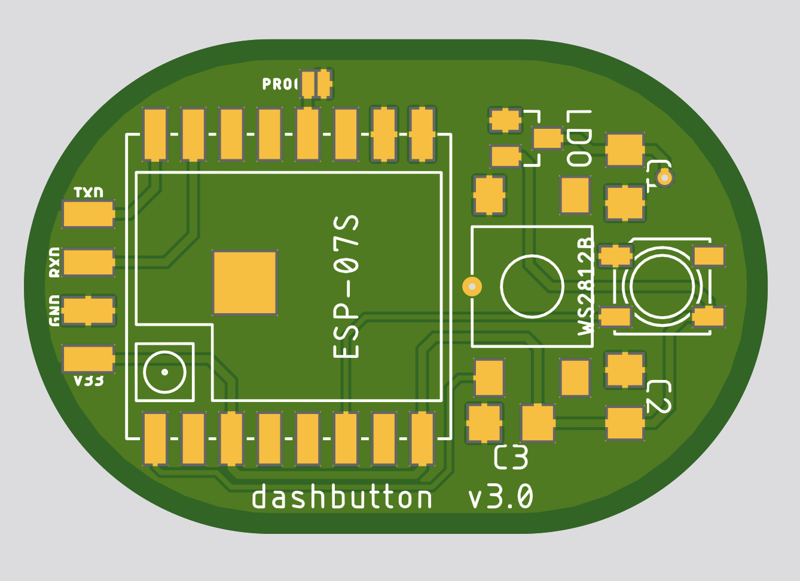

__Version 4__ has the same outer shape as version 3, because it consists of an LIR2450 battery as well. But, as the first version of my dashbuttons, it consists of one more button to act differently in your smart home application. Furthermore you just don't need to shorten the gpio0 solder pad to put the esp in flash mode... I added a small button which pulls the gpio0 to ground while pressing.
I have removed the WS2812 led, which I added in the last version, because it evokes strange behavior while flashing the microcontroller. Instead of this, I added a normal 1206 led to show the current status of the button.

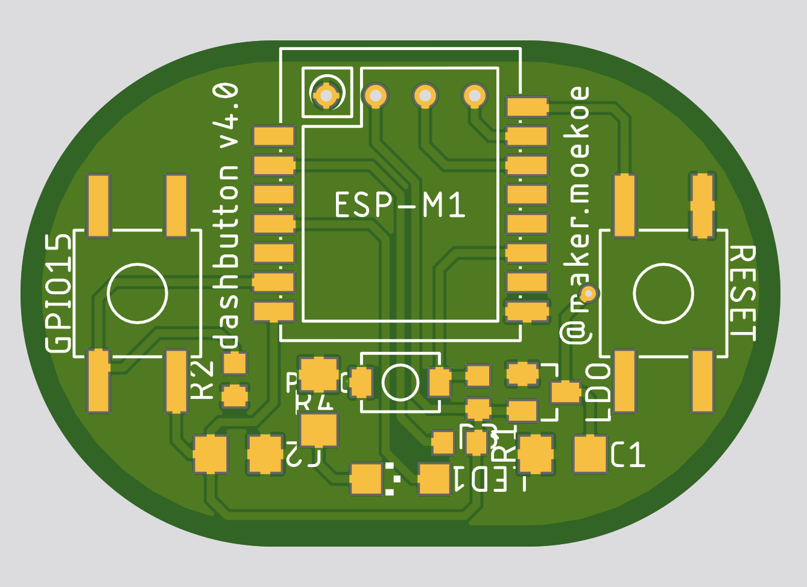

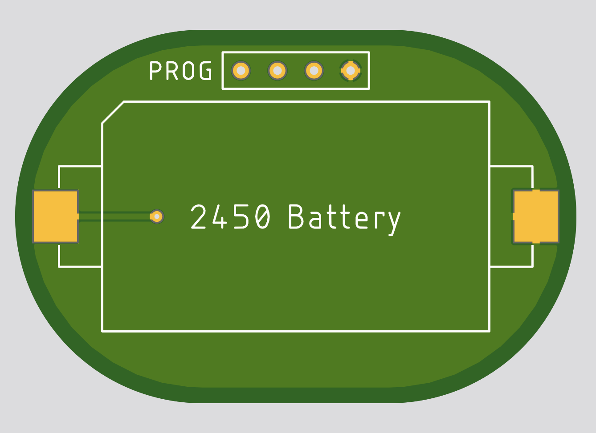

## 3D printed case

The dashbutton should get a small case to prevent some damages to the PCB or to the electronics. If you want, you can design your own housing and print it on your 3d printer like I did. You can start from scratch or you can use my case and add some modifications. Obviously, the housing can be found on [Thingiverse](https://www.thingiverse.com/thing:3364771), but I have attached the files here as well.

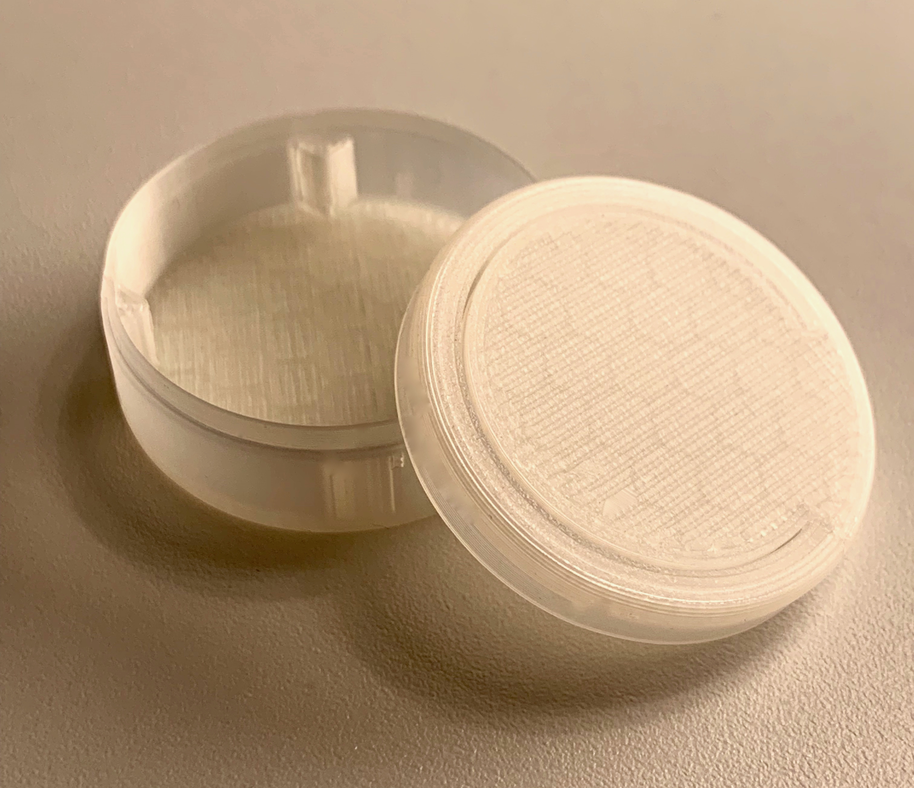

The case for Version 4 can be found on [Thingiverse](https://www.thingiverse.com/thing:3445746) or in this repository as well. For a nice rotary view you can click on the image below.

<a href="https://www.instagram.com/p/BuRV0vyIg5B/?utm_source=ig_web_button_share_sheet">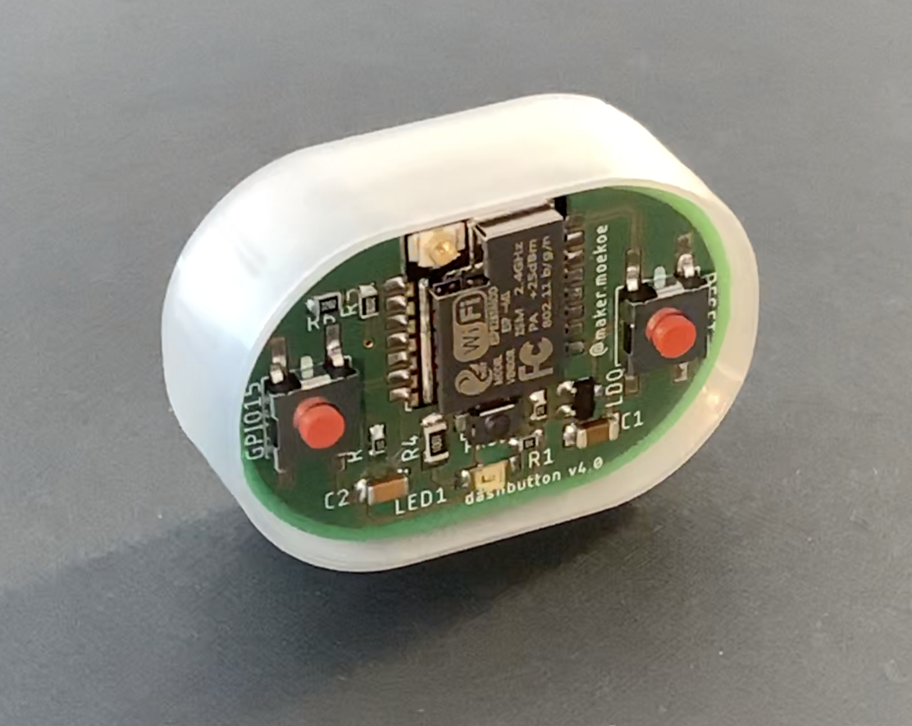</a>

## RSSI measurements

The RSSI measurements listed below refer to the version 4 of my dashbuttons, which is powered by an ESP8285-M1. This ESP version consists of an uFL connector for adding an external antenna. Unfortunately I had to realize that the range of that dashbutton version is something like shit, so I had to do some measurements in order to optimize it.

In the diagrams below I marked three different placements of the dashbutton according to the AP. The __red__ circle is the position directly in front of the AP, __orange__ is about two meters away from it and the distance of the __yellow__ one is about four meters. The unit of the diagrams are dBm.

For testing I used four scenarios (four diagrams):
- without antenna, open uFL connector
- with the only uFL antenna I had at home (think it is from an GPS device)
- with a wire pushed against the middle pin of the uFL connector
- with a desoldered uFL connector and a standard wire soldered to the antenna pad

Maybe the GPS antenna which I used is not the optimal for it, I don't know :D, but the results of it doesn't make me happy.

Because there is not that much place inside of the dashbuttons I will go with the soldered wire first. If anybody of you has a better approach, like a very tiny antenna or something else, than please let me know!

What I didn't observed while doing the measurements is that the GND port of my self-designed programming jack is directly under the uFL connector and when I power the board via this connector may it has influences to the measurements.. I have definitely to try it when it is battery powered. 

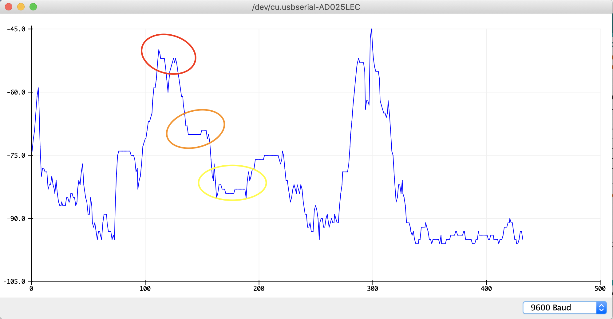

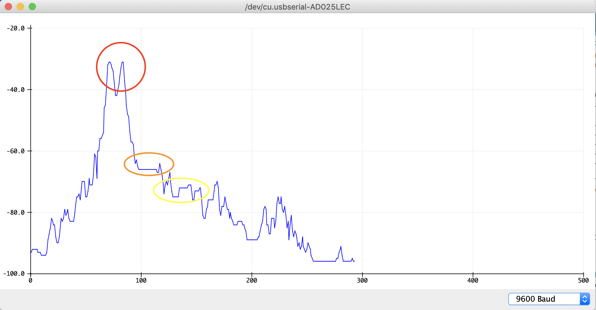

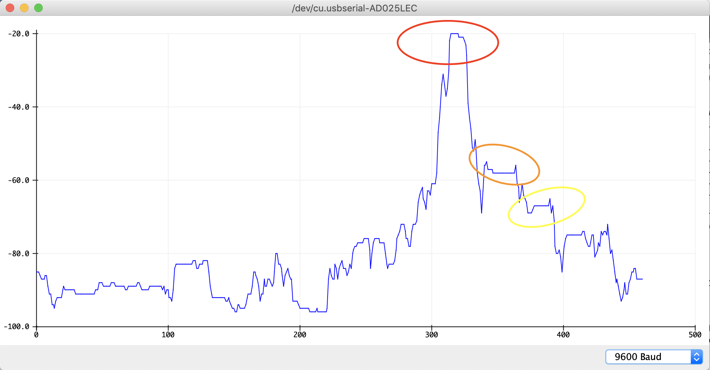

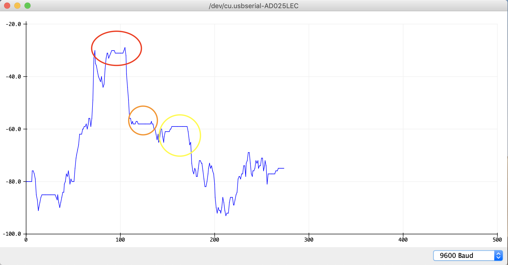

